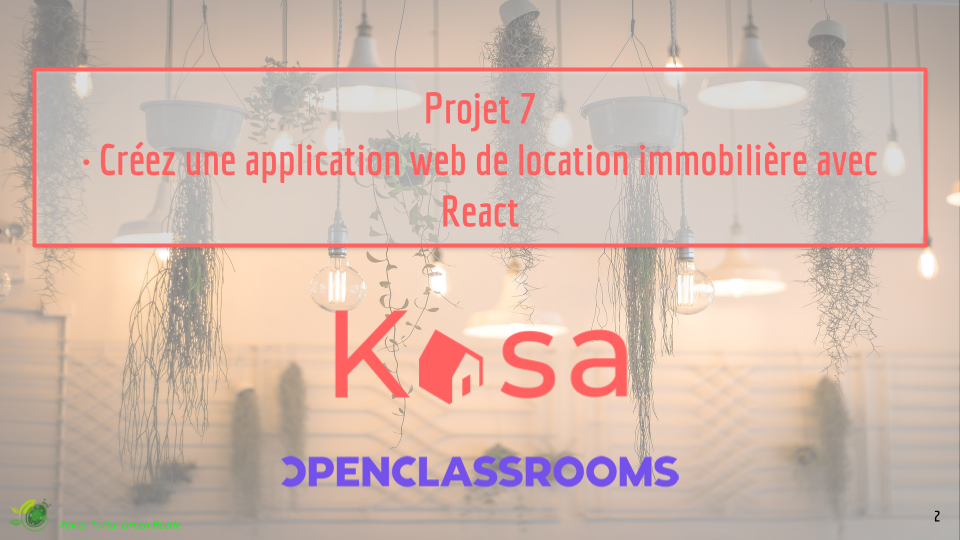
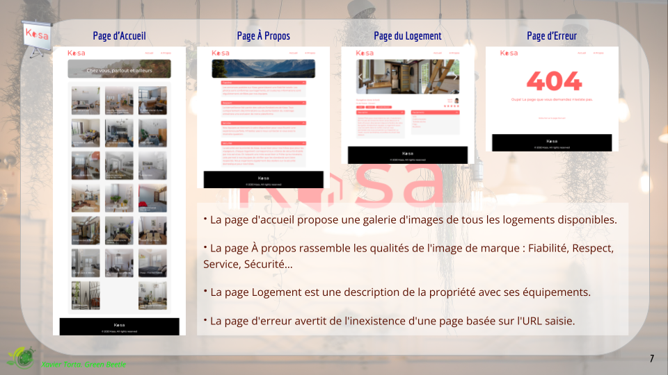
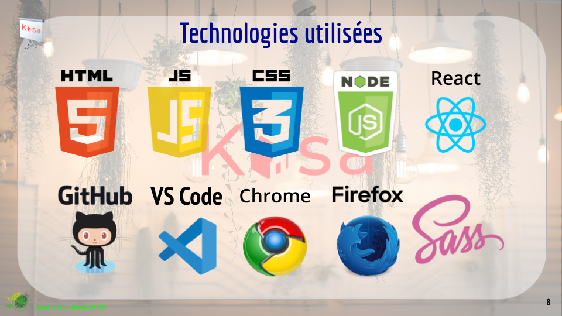
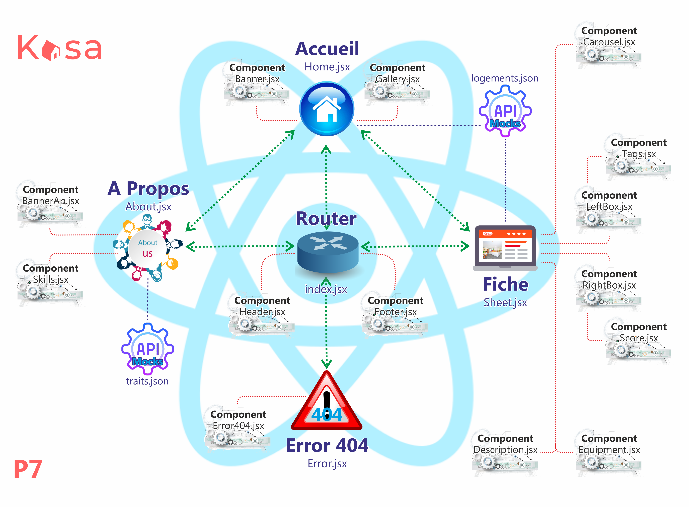

# Kasa

# P7 · Créez une application web de location immobilière avec React

## Auteur

### Repo Développement : <a href="https://github.com/GreenBeetleStore/P7-House.git">Xavier Torta, the Green Beetle </a>

## Presentation

· Vous trouverez ci-dessous la présentation de l'exposition du projet.

<a href="https://docs.google.com/presentation/d/1iGpA9BsqddGyu8RRBpAGEHijB_1yT37_t7oQ78zZtGM/edit?usp=sharing">Presentation Kasa</a>

· Date de réalisation: novembre-désembre 2022.

## Technologies

## Architecture

### Schéma de l'architecture

 
 
 
 
 

==================================================================

# Mission

Ici vous pouvez visiter la page du cours <a href="https://openclassrooms.com/fr/paths/556/projects/677/assignment">Créez une application web de location immobilière avec React</a> d'OpenClassrooms avec tous les détails de la mission.

## <a href="https://course.oc-static.com/projects/D%C3%A9veloppeur+Web/IW_P8+React+Kasa/Guide+d%27etapes+cles+-+Creez+une+application+web+de+location+immobiliere+avec+React.pdf">Guide des étapes clés</a>

### Projet “Implémentez le front-end d'une application bancaire avec React”

Comment utiliser ce document ?

Sur cette page, vous trouverez un exemple de découpage en étapes pour faire votre projet. Vous y trouverez :

● des recommandations pour réussir chaque étape ;

● les problème récurrents et points de vigilance à garder en tête ;

● une estimation de votre avancement sur l’ensemble du projet.

Ce découpage est simplement une suggestion pour vous organiser. Vous n’êtes pas obligé de compléter les étapes dans l’ordre.

Gardez en tête que votre progression sur les étapes n’est qu’une estimation, et sera différente selon votre vitesse de progression.

## Étape 1 : Initialisez le projet

5 % de progression

### 🎯 Avant de démarrer cette étape, je dois avoir :

● Suivi le cours <a href="https://openclassrooms.com/fr/courses/7008001-debutez-avec-react">Débutez avec React</a>.

● Suivi la partie 1 du cours <a href="https://openclassrooms.com/fr/courses/7150606-creez-une-application-react-complete">Créez une application React complète</a>.

● Avoir pris connaissance de la demande relative au projet Kasa.

Une fois cette étape terminée, je devrais avoir :

● L’application React installée et le repo GitHub initialisé.

● Ajouté le fichier JSON qui contient les données.

● L’application de démonstration qui se lance dans le navigateur lorsque je tape `npm start` dans le terminal.

### 📌 Recommandations :

Après vous être assuré d’avoir bien compris tous les éléments demandés pour le projet, initialisez votre projet avec Create React App.

### 📃 Ressources :

● Découvrez la documentation de <a href="https://create-react-app.dev/docs/getting-started">Create React App (CRA)</a> pour des informations toujours actualisées sur comment initialiser votre application.

## Étape 2 : Ajoutez React Router

10 % de progression

### 🎯 Avant de démarrer cette étape, je dois avoir :

● Initialisé mon application.

### 🎯 Une fois cette étape terminée, je devrais avoir :

● React Router et ses dépendances installés sur mon application.

### 📌 Recommandations :

Les librairies JavaScript sont en constante évolution. Si vous avez des difficultés à installer React Router avec les instructions du cours, n’hésitez pas à vous
tourner vers la documentation de React Router et à vérifier la version que vous installez.

### 📃 Ressources :

● Lisez la documentation de <a href="https://reactrouter.com/">React Router</a> pour des informations à jour sur l’installation de la librairie.

## Étape 3 : Créez le routeur et les différentes pages de l’application

25 % de progression

### 🎯 Avant de démarrer cette étape, je dois avoir :

● Installé React Router à l’application.

### 🎯 Une fois cette étape terminée, je devrais avoir :

● Le routage de mon application fonctionnel.

### 📌 Recommandations :

● Lorsque vous créez la logique de routage, profitez-en pour créer les différentes pages de l’application. Posez-vous la question : Que se passe-t-il si j’écris mal l’URL d’une route ou si j’entre une route qui n’existe pas ?

● Pour la navigation dans l’application, vous pourrez soit faire un header et un footer, soit faire un layout dans lequel vous mettrez le reste de l’application via props.children. Pensez à créer ces composants et à y intégrer le composant du router.

● C’est le moment de commencer à faire la mise en page de votre application pour le layout principal. Vous avez pour cela différentes options (CSS, SASS, modules CSS).

### ⚠️ Points de vigilance :

Créer un composant à part pour le routeur.

### 📃 Ressources :

● Recommandations de CRA pour l’utilisation du CSS :

  ○ <a href="https://create-react-app.dev/docs/adding-a-stylesheet">Ajout de feuilles de style</a>
  
  ○ <a href="https://create-react-app.dev/docs/adding-a-css-modules-stylesheet"Ajout de modules CSS (recommandé par CRA)</a>
  
  ○ <a href="https://create-react-app.dev/docs/adding-a-sass-stylesheet"Ajout de SASS
       
## Étape 4 : Créez la page d’accueil
       
40 % de progression
       
### 🎯 Avant de démarrer cette étape, je dois avoir :
       
● La logique de routage fonctionnelle.
       
### 🎯 Une fois cette étape terminée, je devrais avoir :
       
● Les composants banner et card créés.
       
● Une liste des propriétés disponibles.
       
### 📌 Recommandations :
       
● Analysez bien les différents composants et voyez si ceux-ci sont réutilisés dans l’application. Évaluez quels éléments de l’interface nécessitent un composant qui leur est propre.
       
### ⚠️ Points de vigilance :
       
● Attention à ce que la création des cards ne génère pas de warning dans la console.
       
### 📃 Ressources :
       
● Voir la documentation sur les <a href="https://fr.reactjs.org/docs/lists-and-keys.html">listes et clés de React</a> pour voir comment gérer la répétition d’éléments sans warning.
       
##Étape 5 : Créez la page À propos

50 % de progression

### 🎯 Avant de démarrer cette étape, je dois avoir :

● La logique de routage fonctionnelle.

### 🎯 Une fois cette étape terminée, je devrais avoir :

● Le composant Collapse créé.

### 📌 Recommandations :

● Gardez en tête que le Collapse doit avoir deux états différents : il peut être ouvert ou fermé.

● Pensez à bien utiliser les propriétés des composants pour passer les données voulues.

● Souvenez-vous que votre composant peut prendre différentes formes en fonction de son utilisation.

### 📃 Ressources :

● Voir la documentation sur comment <a href"https://fr.reactjs.org/docs/hooks-state.html">gérer l’état dans un composant fonctionnel</a>.

## Étape 6 : Mettez en page la page d’erreur

60 % de progression

### 🎯 Avant de démarrer cette étape, je dois avoir :

● La logique de routage fonctionnelle.

### 🎯 Une fois cette étape terminée, je devrais avoir :

● La page d’erreur fonctionnelle.

### 📌 Recommandations :

● Suivez bien le design de la maquette.

● Assurez-vous que toute route inexistante mène bien à la page d’erreur.

### 📃 Ressources :

● Lisez la <a href="https://reactrouter.com/docs/en/v6/getting-started/faq#how-do-i-add-a-no-match-404-route-in-react-router-v6">FAQ sur la gestion des erreurs dans React Router</a> pour intégrer une page d’erreur 404.

## Étape 7 : Créez le carrousel de la page de logement

75 % de progression

### 🎯 Avant de démarrer cette étape, je dois avoir :

● La logique de routage fonctionnelle.

● Le clic sur les cartes de propriété de la page Home fonctionnel.

### 🎯 Une fois cette étape terminée, je devrais avoir :

● Le composant Slideshow créé.

### 📌 Recommandations :

● Commencez par ajouter les flèches et les bullet points de façon dynamique. Si une propriété n’a qu’une seule image, on ne devrait voir ni flèche ni bullet point.

● Ajoutez les écouteurs d'événement pour qu’au clic le changement d’image se fasse correctement.

### ⚠️ Points de vigilance :

● Attention à ne pas avoir d’erreur lorsque vous vous trouvez aux extrémités du carrousel : le clic sur la flèche gauche à la première diapositive doit vous mener à la dernière image, et vice versa.

### 📃 Ressources :

● Voir cette documentation pour <a href"https://fr.reactjs.org/docs/hooks-state.html">gérer l’état dans un composant fonctionnel</a>.

## Étape 8 : Finalisez la page de logement

85 % de progression

### 🎯 Avant de démarrer cette étape, je dois avoir :

● Le carrousel fonctionnel sur la page.

● Le clic sur les propriétés dans la page d’accueil.

### 🎯 Une fois cette étape terminée, je devrais avoir :

● La page de propriété fonctionnelle.

### 📌 Recommandations :

● Suivez bien le design de la maquette pour intégrer et mettre en page chaque élément.

● Pensez à réutiliser le composant Collapse créé auparavant.

## Étape 9 : Gérez l’erreur sur l’id d’une propriété

90 % de progression

### 🎯 Avant de démarrer cette étape, je dois avoir :

● La page de propriété fonctionnelle.

### 🎯 Une fois cette étape terminée, je devrais avoir :

● Une redirection vers la page d’erreur en cas d’id incorrect.

### 📌 Recommandations :

Utilisez les fonctionnalités de React Router pour gérer l’erreur et rediriger vers la page d’erreur.

### 📃 Ressources :

● Gérez la redirection avec le composant Navigate ou le hook useNavigate.

## Étape 10 : Vérifiez l’ensemble de votre site

100 % de progression

### 🎯 Avant de démarrer cette étape, je dois avoir :

● L’ensemble du projet réalisé.

### 🎯 Une fois cette étape terminée, je devrais avoir :

● Le projet finalisé et vérifié.

### 📌 Recommandations :

● Faites-vous une checklist de tout ce qui était demandé sur le projet.

● Vérifiez que le style correspond à la maquette, y compris en responsive.

● Vérifiez que toutes les erreurs sont bien gérées, en particulier dans la navigation.

● Vérifiez que les composants changeant d’état fonctionnent de manière appropriée (changement des images dans le carrousel, et Collapses qui s’ouvrent et se ferment).

## 🎉 Projet terminé !

 
 
 
 
 

==================================================================

## <a href="https://course.oc-static.com/projects/Front-End+V2/P9+React+1/Coding+guidelines+Kasa+FR.pdf">Outils et contraintes techniques</a>

### 🛠 Outils et contraintes techniques ⚙️

### 🛠 Outils standards

● <a href="https://create-react-app.dev/docs/getting-started/">Create React App</a>

● <a href="https://reacttraining.com/react-router/web/guides/quick-start">React Router</a>

● <b>Styling</b>: L’utilisation de Sass est optionnelle. CSS est à utiliser par défaut.

● <b>Pas de librairie React externe</b>

### ⚙️ Contraintes techniques

### React :

Il est impératif d’utiliser ces éléments de React pour un code de qualité :

● Découpage en composants modulaires et réutilisables ;

● Un composant par fichier ;

● Structure logique des différents fichiers ;

● Utilisation des props entre les composants ;

● Utilisation du state dans les composants quand c'est nécessaire ;

● Gestion des événements ;

● Listes : React permet de faire des choses vraiment intéressantes avec les listes, en itérant dessus, par exemple avec map. Il faut les utiliser autant que possible.

Il est également recommandé, mais pas imposé, d’utiliser des composants fonctionnels plutôt que des composants classes.

### React Router :

● Les paramètres des routes sont gérés par React Router dans l'URL pour récupérer les informations de chaque logement.

● Il existe une page par route.

● La page 404 est renvoyée pour chaque route inexistante, ou si une valeur présente dans l’URL ne fait pas partie des données renseignées.

● La logique du routeur est réunie dans un seul fichier.

### Général :

● Le code ne doit pas produire d'erreur ou de warning dans la console.

 
 
 
 
 

==================================================================

## This project was bootstrapped with [Create React App](https://github.com/facebook/create-react-app).

## Available Scripts

In the project directory, you can run:

### `npm run sass`

Runs Sass for watching changes to style.

### `npm start`

Runs the app in the development mode.\
Open [http://localhost:3000](http://localhost:3000) to view it in your browser.

The page will reload when you make changes.\
You may also see any lint errors in the console.

### `npm test`

Launches the test runner in the interactive watch mode.\
See the section about [running tests](https://facebook.github.io/create-react-app/docs/running-tests) for more information.

### `npm run build`

Builds the app for production to the `build` folder.\
It correctly bundles React in production mode and optimizes the build for the best performance.

The build is minified and the filenames include the hashes.\
Your app is ready to be deployed!

See the section about [deployment](https://facebook.github.io/create-react-app/docs/deployment) for more information.

### `npm run eject`

**Note: this is a one-way operation. Once you `eject`, you can't go back!**

If you aren't satisfied with the build tool and configuration choices, you can `eject` at any time. This command will remove the single build dependency from your project.

Instead, it will copy all the configuration files and the transitive dependencies (webpack, Babel, ESLint, etc) right into your project so you have full control over them. All of the commands except `eject` will still work, but they will point to the copied scripts so you can tweak them. At this point you're on your own.

You don't have to ever use `eject`. The curated feature set is suitable for small and middle deployments, and you shouldn't feel obligated to use this feature. However we understand that this tool wouldn't be useful if you couldn't customize it when you are ready for it.

## Learn More

You can learn more in the [Create React App documentation](https://facebook.github.io/create-react-app/docs/getting-started).

To learn React, check out the [React documentation](https://reactjs.org/).

### Code Splitting

This section has moved here: [https://facebook.github.io/create-react-app/docs/code-splitting](https://facebook.github.io/create-react-app/docs/code-splitting)

### Analyzing the Bundle Size

This section has moved here: [https://facebook.github.io/create-react-app/docs/analyzing-the-bundle-size](https://facebook.github.io/create-react-app/docs/analyzing-the-bundle-size)

### Making a Progressive Web App

This section has moved here: [https://facebook.github.io/create-react-app/docs/making-a-progressive-web-app](https://facebook.github.io/create-react-app/docs/making-a-progressive-web-app)

### Advanced Configuration

This section has moved here: [https://facebook.github.io/create-react-app/docs/advanced-configuration](https://facebook.github.io/create-react-app/docs/advanced-configuration)

### Deployment

This section has moved here: [https://facebook.github.io/create-react-app/docs/deployment](https://facebook.github.io/create-react-app/docs/deployment)

### `npm run build` fails to minify

This section has moved here: [https://facebook.github.io/create-react-app/docs/troubleshooting#npm-run-build-fails-to-minify](https://facebook.github.io/create-react-app/docs/troubleshooting#npm-run-build-fails-to-minify)
